# ClothSense

CASA0016

DY Lim

* * *

  

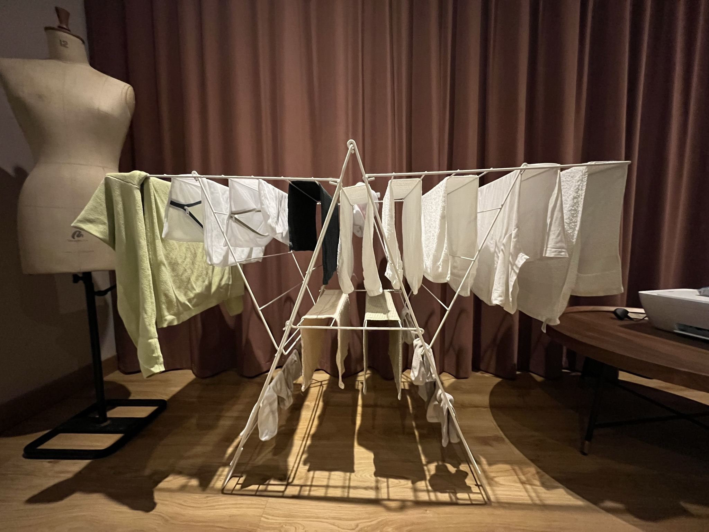

## When is it going to be dried?

###   

### No dryer.

Energy Bill, Damage on cloth, Noise...

  

Every time I needed to touch the cloth to check whether it is dried or still wet.

However, it is **_hard to predict_** even if i do so. 

Also, I want to **_boost the drying process_** and want to **_know the condition_** where it is located(Bad air quality, weather).

  

ClothSense is going to  **monitor**:

- Temperature
- Humidity
- ~~Air Quality~~

ClothSense is going to **boost**:

- Dry State

ClothSense is going to **show:**

- Estimated Time to dry
- Current Environmental Condition

###   

## Component

- Arduino Uno (MCU)
- ~~BME680~~ DHT22 (Environment Sensor) - Digital Pin
- max7219 LED Matrix 8x32 (Display) - SPI
- NF-F12 5V PMW (Fan) - PWM
- Buttons - Digital Pin

  

## Workflow

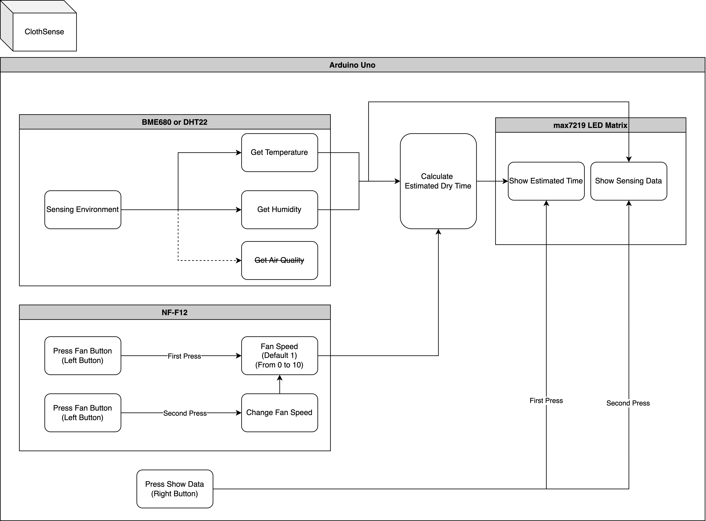

  

## Build Process

### First Prototype

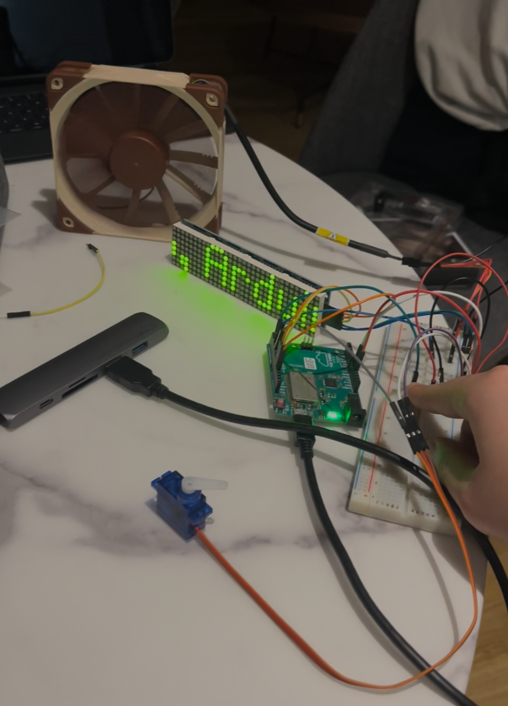  

Tested Fan Control using PWM control

By pressing button, Uno changes fan speed for noise control.

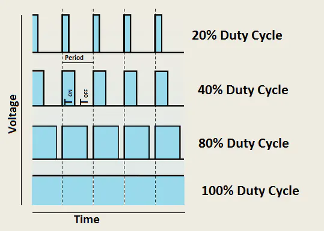  

[Arduino PWM Tutorial - Arduino Project Hub](https://create.arduino.cc/projecthub/muhammad-aqib/arduino-pwm-tutorial-ae9d71)  

  

### Second Prototype

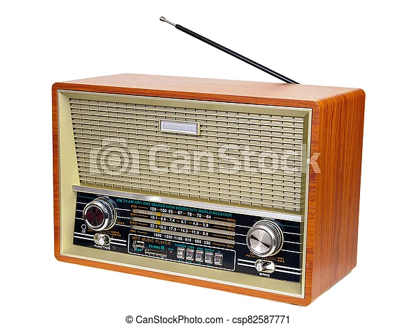  

[Old-fashioned vintage radio isolated on a white background - | CanStock (canstockphoto.com)](https://www.canstockphoto.com/old-fashioned-vintage-radio-isolated-on-82587771.html)  

Inspired by the old fashion radios, got the idea from Prof. Andy.

  

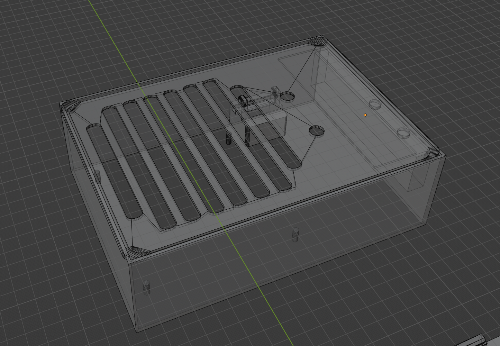  

3D Printing Enclosure

- Slow
- Not Precise
- Good for 3d solid object prototyping

Removed servo

Moved LED Matrix

Changed sie

  

### Third Prototype

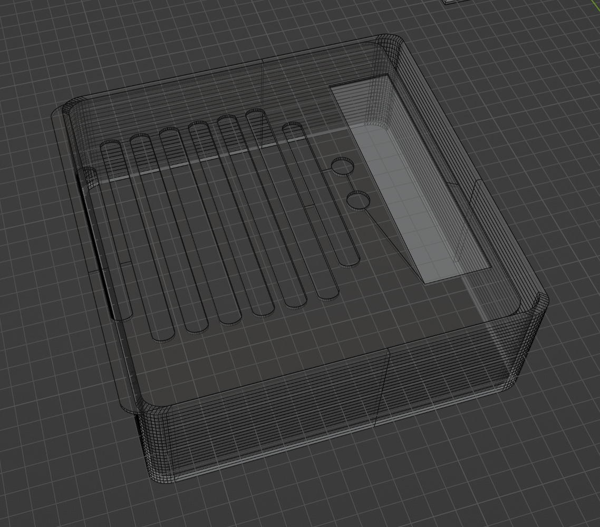  

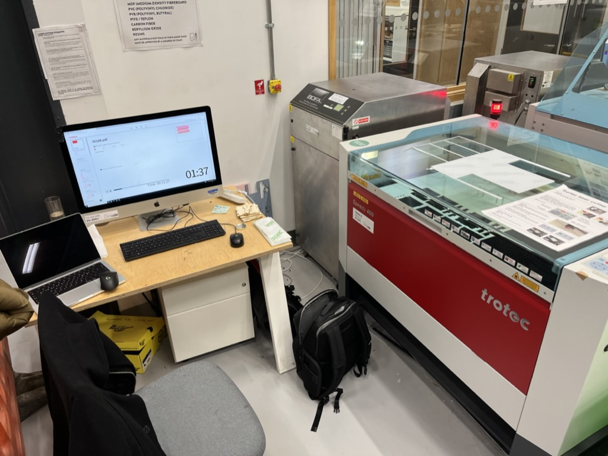  

Laser cut wood enclosure

- Fast
- Precise

3D Printed top lid to hide LED matrix and for aesthetic reason

  

with the enclosure, the device was tested and some problems are found:

1. BME680 library uses more than 30% of maximum sketch storage. (From 70% to 117%)

- [Reduce the size and memory usage of your sketch – Arduino Help Center](https://support.arduino.cc/hc/en-us/articles/360013825179-Reduce-the-size-and-memory-usage-of-your-sketch)  
    
- Remove BME680 and use  DHT22
- Use Arduino Uno instead of Leonardo (LoRa Library)
- Optimised variables and functions

3. Did not design the component mounting

- Made some mounting brackets
- 

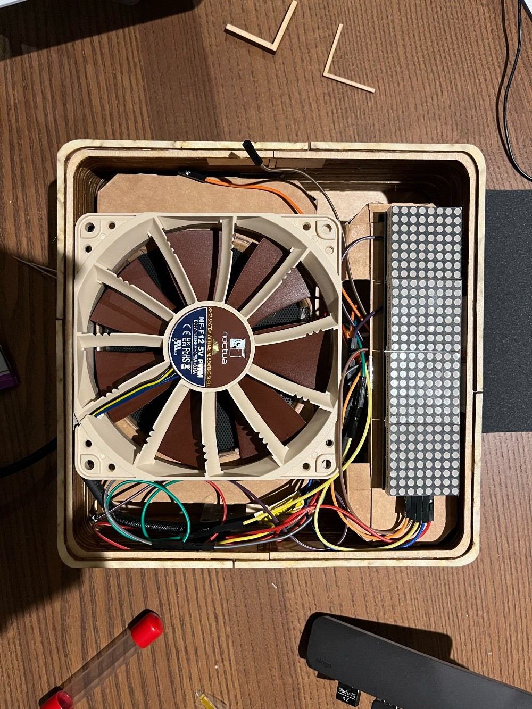  

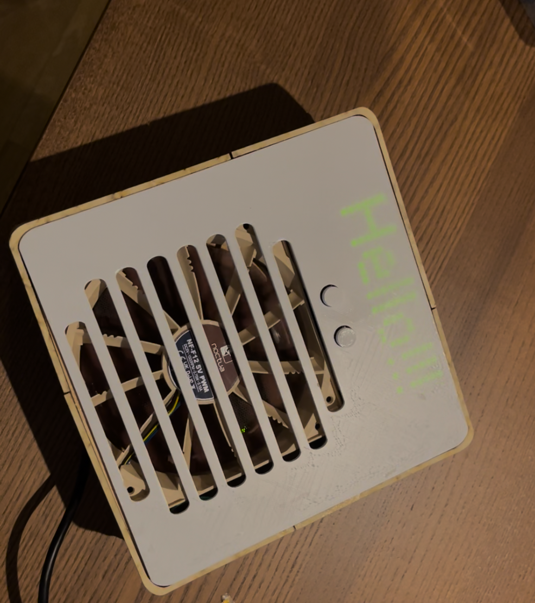  

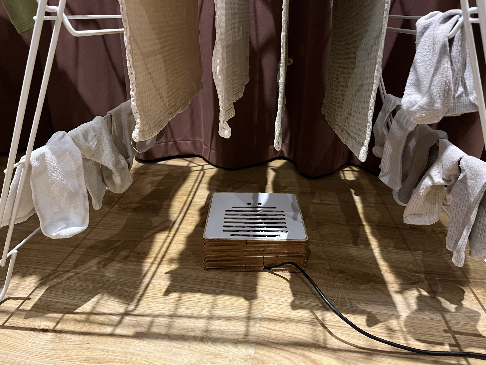  

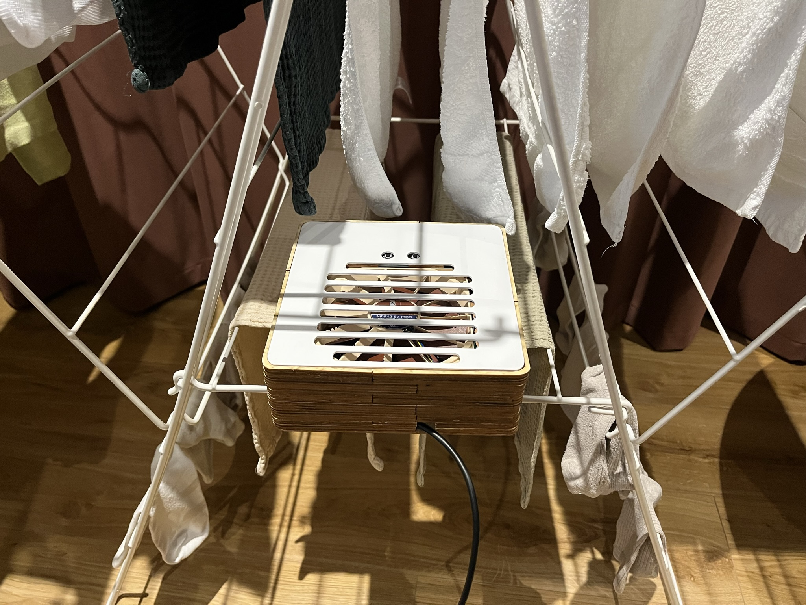  

  

## If i had more time, I would

- Use wireless data transmission such as WiFi, LoRa...
- Improve the enclosure
- Order a custom PCB board to reduce the device size

  

## Where can it be used?

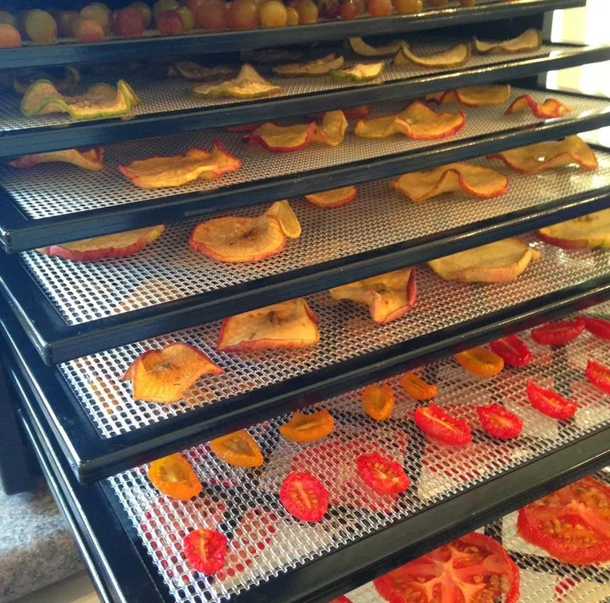  

[A Grade Dehydrated Vegetables, Pan India, Packaging Size: 5 Kg at Rs 350/kg in New Delhi (indiamart.com)](https://www.indiamart.com/proddetail/dehydrated-vegetables-24169149248.html)  

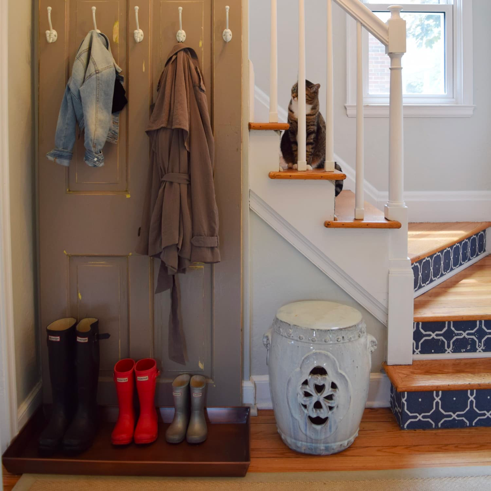  

[9 Hat and Coat Storage Ideas When You Don't Have a Coat Closet | Apartment Therapy](https://www.apartmenttherapy.com/9-creative-ways-to-organize-your-coats-and-hats-by-the-door-when-you-dont-have-a-coat-closet-239859)  

  

## Lesson Learnt

- Test, Test, Test and Test.

- Even though the several design, Some improvement can be made.

- Laser Cutter is better than what I expected.

- If the prototype shape is not complicate, Laser cutter is a good option. 

- The bouncing issue is too difficult (If you only use software debouncing).

- Depends on the type of button, wire, etc..., the button needed to be calibrated.

  

## Reference

_Adafruit BME680_ (no date) _Adafruit Learning System_. Available at: [https://learn.adafruit.com/adafruit-bme680-humidity-temperature-barometic-pressure-voc-gas/overview](https://learn.adafruit.com/adafruit-bme680-humidity-temperature-barometic-pressure-voc-gas/overview) (Accessed: 21 November 2022).

_BME680 Breakout - Air Quality, Temperature, Pressure, Humidity Sensor - Pimoroni_ (no date). Available at: [https://shop.pimoroni.com/products/bme680-breakout](https://shop.pimoroni.com/products/bme680-breakout) (Accessed: 21 November 2022).

_Leonardo | Arduino Documentation_ (no date). Available at: [https://docs.arduino.cc/hardware/leonardo](https://docs.arduino.cc/hardware/leonardo) (Accessed: 28 November 2022).

_OctoPrint Login_ (no date). Available at: [http://octopi-prusa-2.celab/login/?redirect=%2F%3F&permissions=STATUS%2CSETTINGS\_READ](http://octopi-prusa-2.celab/login/?redirect=%2F%3F&permissions=STATUS%2CSETTINGS_READ) (Accessed: 6 December 2022).

_PWM conflict? One DC servo, one PWM fan motor - Using Arduino / Motors, Mechanics, Power and CNC_ (2020) _Arduino Forum_. Available at: [https://forum.arduino.cc/t/pwm-conflict-one-dc-servo-one-pwm-fan-motor/662796](https://forum.arduino.cc/t/pwm-conflict-one-dc-servo-one-pwm-fan-motor/662796) (Accessed: 3 December 2022).

_UNO R3 | Arduino Documentation_ (no date). Available at: [https://docs.arduino.cc/hardware/uno-rev3](https://docs.arduino.cc/hardware/uno-rev3) (Accessed: 14 December 2022).