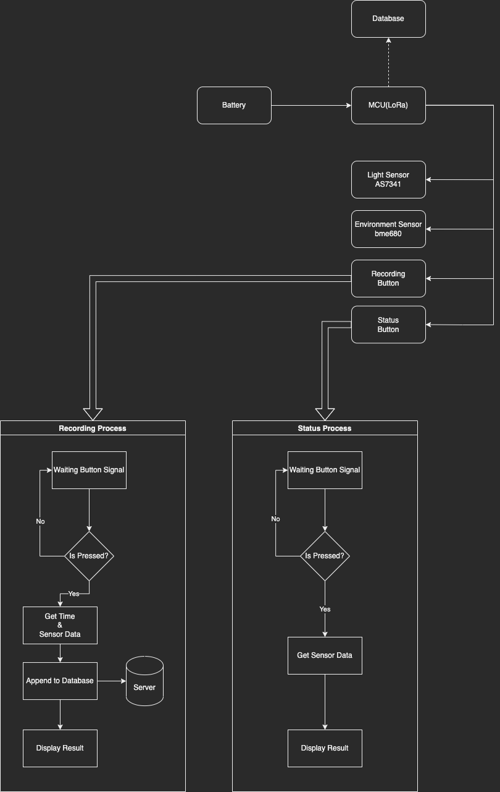
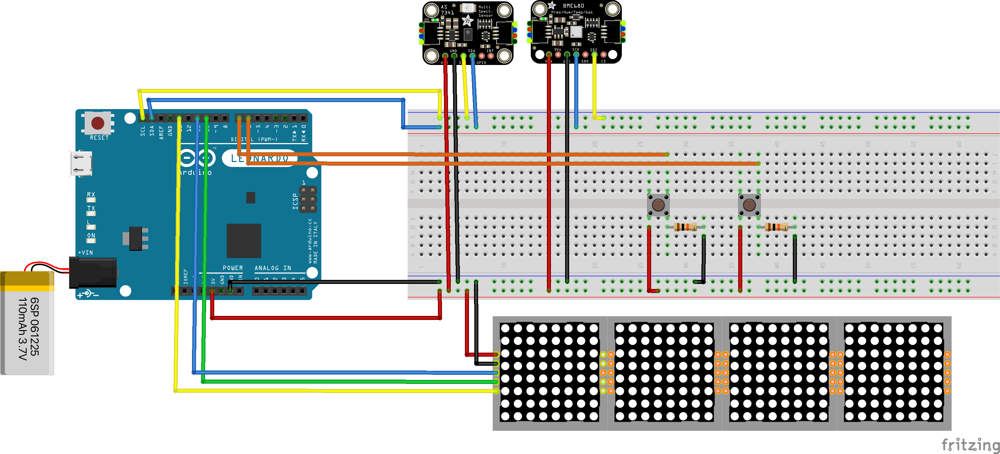
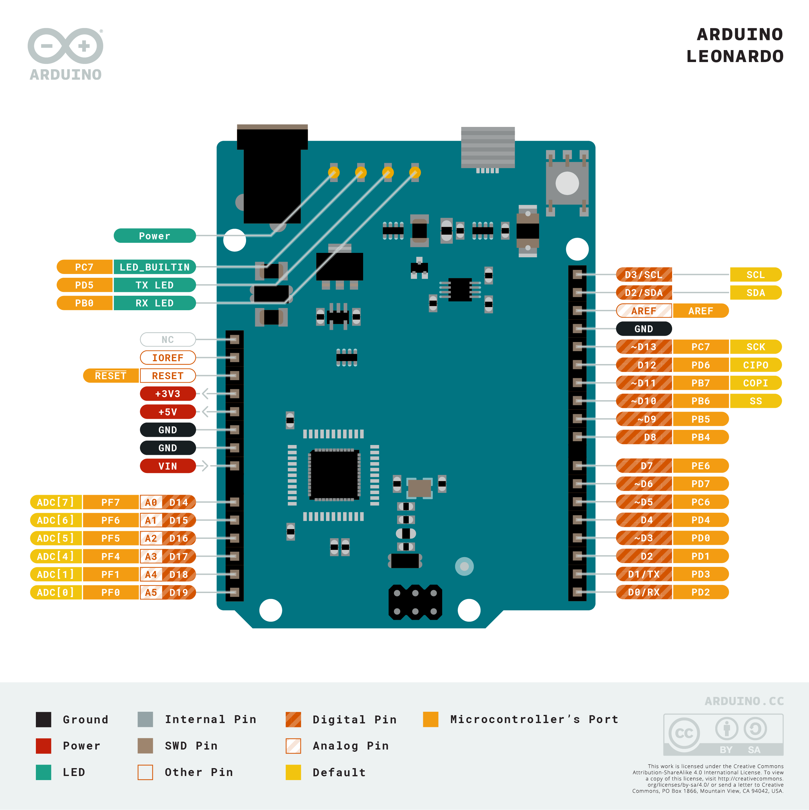

### ClothSense
##### CASA0016
---

Factors
- Time
- Temperature
- Humidity
- Air Quality
- Light
- etc

## Overall

## Diagram

### Sensor Communication Protocol
- LED Matrix : SPI
- bme680 : I2C
- AS7341 : I2C

## LoRaWAN
- Long-Range Transmissions
- Low Power
- The Things Network
